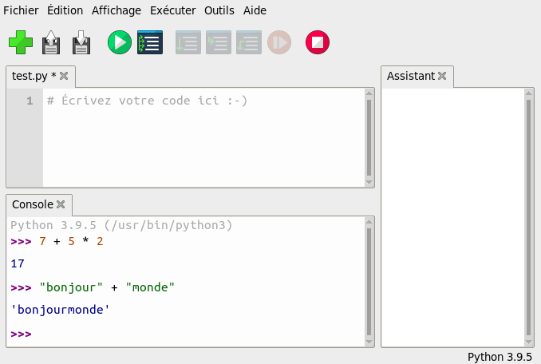

Les fondements du language Python
=================================

Chacun des exercices de ce chapitre vous demandent d'écrire un programme. Les solutions aux exercices se trouvent souvent à la page suivante, mais n'allez pas la voir avant d'avoir essayer de répondre par vous-mêmes. Enregistre chacun des programmes dans son propre fichier.

.. sidebar:  Note à l'instructeur

   Contrairement au reste de cet ouvrage, les exemples de ce chapitre
   ne sont pas des jeux. Vous pourriez seulement discutez de certains
   des exercices au lieu de demander à vos élèves de les faires. De
   plus, vous pourriez sauter ce chapitre en entier et laisser sa
   lecture pour les élèves plus motivés qui ont du temps libre à la
   maison. Il est aussi possible d'utiliser ces exercices pour
   renforcer les concepts vuent dans les exercices de jeux pour les
   élèves qui nécessitent plus d'examples. Il y a aussi des exercices
   plus formel dans ce chapitre qui pourraient servir à évaluer les
   élèves dans un contexte académique.

Le REPL
-------

Le REPL signifie *Read Evaluate Print Loop* ou *Lit Évalue Affiche Boucle* en français. Dans l'éditeur Thonny tu peux avoir accès à ce logiciel grâce à l'onglet ``Console`` au bas de la fenêtre. Le REPL est un logiciel dans lequel tu tape des instructions à Python afin que Python exécute immédiatement la commande (pas besoin de cliquer sur ``Exécuter``) pour ensuite afficher le résultat dans la console (pas besoin de taper ``print()``). Il est utile pour faire des calculs rapide et pour essayer des petits segments de code, mais le REPL ne va pas sauvegarder les commandes tapés. Il sert donc seulement pour des programmes très court.

   Le REPL

Les opérateurs arithmétiques
----------------------------

Python comprend plusieurs opérateurs mathématiques. Tu peux t'en servir dans tes programmes ou entrer ces exemples dans le REPL afin d'utiliser Python comme une calculatrice. C'est ce qui est fait dans l'image ci-dessus.

============== ======= ======== ======
Opérateur      Symbole Exemple  Result
============== ======= ======== ======
Addition       \+      20 + 10  30
Soustraction   \-      20 - 10  10
Multiplication \*      20 \* 10 200
Division       /       20 / 10  2
============== ======= ======== ======

Il y a aussi des opérateurs plus avancés dans
:numref:`code-shortcuts`.

Les variables
-------------

Une *variable* est un endroit dans la mémoire de l'ordinateur où une ou des données sont stockées. Tu peux nommer ta variable pratiquement n'importe quoi, mais tu devrais tout de même faire en sorte que son nom soit représentatif de ce qu'elle contient. Il y a plusieurs *types* de varibles, mais Python gère la majorité de ces types pour nous lorsqu'on stocke des données dans la variable. (Contrairement à plusieurs autres language de programmation, nous n'avons pas besoin de spécifier le type de nos varibles.) Les types de varible les plus courrant sont les nombres entiers (*integer*) et les chaines de charactère (*string*).

Nous pouvons créer des variables et leur assigner des valeur en utilisant l'opérateur d'assignation ``=``. Attention, cet opérateur est différent de l'opérateur de comparaisons ``==``.

On peut utiliser la fonction ``print()`` afin d'afficher dans la Console les valeurs de nos variables. Cette fonction affiche tout type de données (les nombres, les chaînes de charactères, les littéraux et les variables) en autant que chaque élément ou argument entre parenthèse de la fonction est séparé par une virgule (``,``).

.. code-block::
   :caption: Assignation de variables
   :name: variables

   mon_nombre = 7
   mon_mot = "allô"
   print(mon_nombre, mon_mot)

On peut utiliser des variables aux mêmes endroits qu'on peut utiliser des littéraux et des chaînes de charactères. Lorsque Python trouve une variable dans ton code, la valeur de la variable sera récupérée de la mémoire de l'ordinateur et susbtitué là où se trouve le nom de la variable. Cette opération est faite pour chacune des expressions où se trouve des variables.

.. code-block::
   :caption: Ajouter deux variables
   :name: code-fruits

   pommes = 27
   poires = 33
   fruits = pommes + poires
   print("Nombre de fruits: ", fruits)

.. topic:: Exercice

   Copie :numref:`code-fruits`, mais ajoute 17 bananes au calcul de fruits.

We can store a new value in the same variable. The old value will be
forgotten.

.. code-block::
   :caption: Overwriting a variable with a new value
   :name: code-overwriting

   apples = 27
   apples = 40
   print("Number of apples:", apples)

.. topic:: Question

   What do you think :numref:`code-overwriting` will print?  If you aren't sure, type it in.

More usefully, we can take the old value, modify it, then store it back
in the same variable.

.. code-block::
   :caption: Modifying a variable
   :name: mod_variables

   x = 5
   x = x * 10
   x = x + 7
   print(x)

.. topic:: Exercise

   What will :numref:`mod_variables` print?  Change the numbers in the program.  Use a division `/` operation.  Then ask your friend to predict what the new program will print.  Was he right?

You will often see this used for counting:

.. code-block::
   :caption: Counting
   :name: counting

   total = 0
   total = total + 1
   total = total + 1
   total = total + 1
   print(x)

.. topic:: Question

   What is the total count of :numref:`counting` ?

See :numref:`code-shortcuts` for a quicker way of
writing this.

Input
-----

:numref:`code-fruits` is not very useful if the number
of apples changes. This would require the *programmer* to change the
program. We can improve it by allowing the *user* of the program to
change the numbers. The ``input()`` function allows the user to type a
string which can be different every time the program is run.

.. code:: python

   my_string = input()
   print(my_string)

Sometimes we want the user to type in a number rather than a string. We
can combine the ``int()`` function with the ``input()`` function to
convert the string to a number.

.. code-block::
   :caption: Getting input from user
   :name: input3

   print("Enter a number")
   my_number = int(input())
   print("Double your number is", my_number * 2)

.. topic:: Exercise

   Copy :numref:`code-fruits` but use `input()` to ask the user to enter the number of apples and pears.

Booleans
--------

A *boolean* is another type of variable that is not a string or a
number. It can have only two possible values: ``True`` or ``False``. In
some languages and in electronics you may see these represented as ``0``
and ``1``.

Booleans are used by keywords such as ``if`` and ``while``. In an ``if``
statement, the indented code block is only run if the boolean is
``True``.

.. code:: python

   sunny = True
   if a:
       print("Let's go to the park")

You could write it like this:

.. code:: python

   sunny = True
   if sunny==True:
       print("Let's go to the park")

but that would be redundant because ``if`` always tests if the boolean
is ``True``.

If the boolean is not true, and if you write an ``else`` clause, the
indented code block under ``else`` is run instead.

.. code:: python

   sunny = False
   if sunny:
       print("Let's go to the park")
   else:
       print("We must stay at home")

Comparison operators
--------------------

Comparison operators take two numbers, strings or other variables,
compare them, and then return a *boolean* ``True`` or ``False`` from
them.

===================== ======
Operator              Symbol
===================== ======
Equal                 ==
Not equal             !=
Less than             <
Less than or equal    <=
Greater than          >
Greater than or equal >=
===================== ======

.. literalinclude:: programs/09_logic2.py
   :caption: Comparisons: greater than, lesser than, equal to
   :name: code-logic2
   :linenos:

Boolean logic
-------------

The ``and``, ``or`` and ``not`` operators operate on booleans and return
new boolean values.

.. literalinclude:: programs/08_logic.py
   :caption: Boolean operators
   :name: code-logic
   :linenos:

.. topic:: Exercice

    Change the values of `a` and `b` in :numref:`code-logic` and see what output is printed by different combinations of `True` and `False`.

Or
~~

Only people older than 12 or taller than 150cm are allowed to ride the
rollercoaster. This program checks whether people are allowed to ride.

.. code:: python

   print("How old are you?")
   age = int(input())
   print("How tall are you?")
   height = int(input())
   if age > 12:
       print("You can ride")
   elif height > 150:
       print("You can ride")
   else:
       print("YOU MAY NOT RIDE, GO AWAY!")

Boolean operators combine two truth values together. The ``or`` operator
is ``True`` if either of its operands is true. Try this example:

.. code:: python

   a = True
   b = False
   print(a or b)

.. topic:: Exercise

   Use the `or` operator to make the rollercoaster program shorter by combining the two tests into one test.

A possible solution:

.. code:: python

   print("How old are you?")
   age = int(input())
   print("How tall are you?")
   height = int(input())
   if age > 12 or height > 150:
       print("You can ride")
   else:
       print("YOU MAY NOT RIDE, GO AWAY!")

And
~~~

The ``and`` operator is ``True`` if both of its operands is true. Try
this example:

.. code:: python

   a = True
   b = False
   print(a and b)

.. topic:: Exercise

   The rollercoaster is only allowed to run on days when the temperature is less than 30 degrees.  Extend the program to ask the temperature and use the `and` operator to only allow riding when less than 30 degrees.

A possible solution:

.. code:: python

   print("How old are you?")
   age = int(input())
   print("How tall are you?")
   height = int(input())
   print("What is the temperature?")
   temp = int(input())
   if (age > 12 or height > 150) and temp < 30:
       print("You can ride")
   else:
       print("YOU MAY NOT RIDE, GO AWAY!")

Note that we have put brackets around the ``or`` expression. This
ensures it is calculated first and the result of that calculation is
then used in the ``and`` expression. This is the same way you use the
BODMAS rule to decide the order of operations in maths.

Not
~~~

The ``not`` operator is ``True`` if its operand is ``False``. If its
operand is ``False`` then it is ``True``. Try this example:

.. code:: python

   a = True
   b = False
   print(not a)
   print(not b)

We can get a user input and convert it to a boolean like this:

.. code:: python

   print("Is it raining? Y/N")
   if input() == "Y":
       raining = True
   else:
       raining = False

.. topic:: Exercise

   Change the program so that you can only ride the rollercoaster if it is not raining.

Possible solution:

.. code:: python

   print("Is it raining? Y/N")
   if input() == "Y":
       raining = True
   else:
       raining = False
   print("How old are you?")
   age = int(input())
   print("How tall are you?")
   height = int(input())
   print("What is the temperature?")
   temp = int(input())
   if (age > 12 or height > 150) and temp < 30 and not raining:
       print("You can ride")
   else:
       print("YOU MAY NOT RIDE, GO AWAY!")

For loops
---------

A ``for`` loop repeats a block of code a number of times. A variable is
created which we can use to find the current number within the loop.
Here the variable is called ``x`` but you can name it whatever you like.
Run this program:

.. code:: python

    for x in range(0, 11):
        print(x)

You can also change the *step* of the loop. Run this program:

.. code:: python

    for x in range(0, 11, 2):
        print(x)

Nested loops
~~~~~~~~~~~~

It is often useful to put one loop inside another loop.

.. code-block::
   :caption: Nested for loop
   :name: code-for_loop
   :linenos:

   for a in range(0, 6):
       for b in range(0, 6):
           print(a, "times", b, "is", a * b)

.. topic:: Exercise

   Write a program which prints out the 12 times table.

Incrementing a variable in a loop
~~~~~~~~~~~~~~~~~~~~~~~~~~~~~~~~~

A baker has three customers. He asks them each how many cakes they want
so he knows how many he must bake. He writes this program.

.. code:: python

    total = 0
    print("Customer", 1, "how many cakes do you want?")
    cakes = int(input())
    total = total + cakes
    print("Customer", 2, "how many cakes do you want?")
    cakes = int(input())
    total = total + cakes
    print("Customer", 3, "how many cakes do you want?")
    cakes = int(input())
    total = total + cakes
    print("I will bake", total, "cakes!")

.. topic:: Exercise

   This program is longer than it needs to be.  Write your own program that does the same thing using a `for` loop.  It should be only 6 (or fewer) lines long.

.. code-block::
   :caption: Possible solution to baker program exercise
   :name: code-baker
   :linenos:

    total=0
    for x in range(1, 4):
        print("Customer", x, "how many cakes do you want?")
        cakes = int(input())
        total = total + cakes
    print("I will bake", total, "cakes!")

.. topic:: Exercise

   The baker gets a fourth customer.  Change :numref:`code-baker` so it works for 4 customers.

.. topic:: Exercise

   The baker has a different number of customers every day.  Change the program so it
   asks how many customers there are. Store the number typed by the user in a variable
   called `c`. Change the loop so it works for `c` customers rather than 4 customers.

.. code-block::
   :caption: Possible solution to variable number of customers exercise
   :name: code-baker2
   :linenos:

    print("How many customers are there today?")
    c = int(input())
    total=0
    for x in range(1, c+1):
        print("Customer", x, "how many cakes do you want?")
        cakes = int(input())
        total = total + cakes
    print("I will bake", total, "cakes!")

.. topic:: Exercise

   If a customer orders 12 cakes, he gets an extra cake for free.  Use an `if` statement to check `cakes > 12`. If so, add one more cake.

Array lists
-----------

Variables can be stored together in a *list*. Most languages call this
an *array* so try to remember that word also. [1]_

.. literalinclude:: programs/0C_arrays.py
   :caption: Array lists
   :name: code-arrays
   :linenos:

Looping over lists
~~~~~~~~~~~~~~~~~~

Rather than the user typing in data, your program might be supplied with
data in a list. Here is a list of prices - a shopping list. Note we
don’t use a currency symbol except when we print the price.

.. code:: python

   prices = [3.49, 9.99, 2.50, 20.00]
   for x in range(0, 4):
       print("item costs £", prices[x])

In this program ``x`` is used an *index* for the array. Note that
indices begin at ``0`` rather than ``1``. If the array contains 4
elements then the final element will have index ``3``, nor ``4``.

However, ``for`` can directly give you all the array values without the
need for an index or to specify the size of the range:

.. code-block::
   :caption: A shopping list
   :name: code-shoppinglist
   :linenos:

   prices = [3.49, 9.99, 2.50, 20.00]
   for price in prices:
       print("item costs £", price)

.. topic:: Exercise

   Change the :numref:`code-shoppinglist` so that it prints the total price of all the items added together.

.. code-block::
   :caption: Possible way of calculating the total cost of shopping list
   :name: code-shoppinglist2
   :linenos:

   prices = [3.49, 9.99, 2.50, 20.00]
   total = 0
   for price in prices:
       print("item costs £", price)
       total = total + price
   print("shopping total", total)

There is a problem with solution, can you see what it is when you run
it?

The problem is that we are using *floating point* numbers for the prices
and floating point maths in the computer is not entirely accurate, so
the answer will be very slightly wrong. One way to fix this is to round
the result to two decimal places using the ``round()`` function:

.. code:: python

   print("shopping total", round(total,2))

This works for a short list, but if the list was millions of items long
it might not give the right result. Can you think of a better way?

Instead of storing the number of pounds, store the the number of
pennies. Britain no longer has a half-penny, so the numbers will always
be whole numbers - *integers* - and no floating points will be needed
for the addition.

.. code-block::
   :caption: Better way of calculating the total cost of shopping list
   :name: code-shoppinglist3
   :linenos:

   prices = [349, 999, 250, 2000]
   total = 0
   for price in prices:
       print("item costs £", price/100)
       total = total + price
   print("shopping total", total/100)

.. topic:: Exercise

   Conditional discount.  Any item that costs more than £10 will be discounted by 20 percent. Use an `if` statement to check if the price is more than 1000 pennies.
   If it is, multiply the price by 0.8 to reduce it before you add it to the total.

.. code-block::
   :caption: Possible way of discounting shopping list
   :name: code-shoppinglist4
   :linenos:

   prices = [349, 999, 250, 2000]
   total = 0
   for price in prices:
       print("item costs £", price/100)
       if price > 1000:
           price = price * 0.8
           print("  item discounted to", price/100)
       total = total + price
   print("shopping total", total/100)

Functions
---------

You may have seen specially named functions that are called by Pygame:
``draw()`` and ``update()``. However, you can define a function named
whatever you like and call it yourself.

Functions are useful for many reasons. The simplest is that they make
your program look more organized. They also enable you re-use code
without needing to copy it and risk making mistakes. When your programs
get longer they enable you to create *abstractions* so you only have to
think about what function you want to call and don’t need to remember
the details of the code inside the function.

.. literalinclude:: programs/0D_functions.py
   :caption: Functions
   :name: code-functions
   :linenos:

Shortcuts
---------

Here are quicker ways of doing basic things. You may have noticed some
of these being used already.

.. literalinclude:: programs/0A_shortcuts.py
   :caption: Shortcuts
   :name: code-shortcuts
   :linenos:

Indentation
-----------

Code is arranged in *blocks*. For example, a *function* consists of a
one line declaration followed by a block of several lines of code.
Similarly, all the lines of a loop form one block. A *conditional* has a
block of code following the ``if`` statement (and optionally blocks
after the ``elif`` and ``else``. )

Many languages use ``{}`` or ``()`` to delimit a block. However Python
is unusual: each block begins with ``:`` and then all the lines of the
block are *indented* by the same amount of whitespace (tabs or spaces).
The block ends when the indentation ends.

Blocks can be *nested* inside other blocks.

.. literalinclude:: programs/blocks.py
   :caption: Can you predict what this program will print?
   :name: code-blocks
   :linenos:

Global variables
----------------

A variable defined inside a function has *local scope*: it cannot be
used outside of the function. If you want to use the same variable in
different functions then you must define it outside the functions, in
the *global scope*. However, if you attempt to modify the value of the
global variable inside a function you will get an error, or - even worse
- you will create a local variable with the same name as the global
variable and your changes to the global variable will be silently lost.

You must explicitly tell Python that you want to use a global variable
with the ``global`` keyword.

.. code-block::
   :caption: Try removing line 3 and see what happens
   :name: code-globals
   :linenos:

   a = 10
   def my_function():
       global a
       a=20
   my_function()
   print(a)

Dictionaries
------------

A dictionary (called a *HashMap* in some languages) stores pairs of
values. You can use the first value to look-up the second, just like how
you look-up a word in a dictionary to find its meaning. Here is a
dictionary of the ages of my friends:

.. code:: python

   friends = {'richard': 96, 'john': 12, 'paul': 8}
   print("What is your name?")
   name = input()
   age = friends[name]
   print("Your age is", age)

.. topic:: Exercise

   Change the program so it contains 5 of your friends' ages.

Counting
~~~~~~~~

Here is a loop that prints out all the ages:

.. code:: python

   friends = {'richard': 96, 'john': 12, 'paul': 8}
   for name, age in friends.items():
       print(name, "is age", age)

.. topic:: Exercise

   Can you add an `if` statement to only print the ages of friends older than 10?

Possible solution:

.. code:: python

   friends = {'richard': 96, 'john': 12, 'paul': 8}
   for name, age in friends.items():
       if age > 10:
           print(name, "is age", age)

.. topic:: Exercise

   Now add a `count` variable that counts how many of the friends are older than 10.  Print the number at the end.

Possible solution:

.. code:: python

   friends = {'richard': 96, 'john': 12, 'paul': 8}
   count = 0
   for name, age in friends.items():
       if age > 10:
           count = count + 1
   print("friends older than 10:",count)

Combining tests
~~~~~~~~~~~~~~~

.. topic:: Exercise

   Use the `and` operator together with the `<` and `>` operators to only count friends between the ages of 11 to 13.

Possible solution:

.. code:: python

   friends = {'richard': 96, 'john': 12, 'paul': 8}
   count = 0
   for name, age in friends.items():
       if age > 10 and age < 14:
           count = count + 1
   print("friends age 11 to 13 :",count)

Finding
~~~~~~~

We make a variable ``oldest`` that will contain the oldest age in the
list.

.. code:: python

   friends = {'richard': 96, 'john': 12, 'paul': 8}
   oldest = 0
   for name, age in friends.items():
       if age > oldest:
           oldest = age
   print("oldest age", oldest)

.. topic:: Exercise

   Make a variable `youngest` that will contain the youngest age in the list.  Print the youngest at the end.

Possible solution:

.. code:: python

   friends = {'richard': 96, 'john': 12, 'paul': 8}
   oldest = 0
   youngest = 100
   for name, age in friends.items():
       if age > oldest:
           oldest = age
       if age < youngest:
           youngest = age
   print("oldest age", oldest)
   print("youngest age", youngest)

Finding names
~~~~~~~~~~~~~

.. topic:: Exercise

   As well as the ages, print the names of the youngest and oldest friends.

Possible solution:

.. code:: python

   friends = {'richard': 96, 'john': 12, 'paul': 8}
   oldest = 0
   youngest = 100
   for name, age in friends.items():
       if age > oldest:
           oldest = age
           oldname = name
       if age < youngest:
           youngest = age
           youngname = name
   print("oldest friend", oldname)
   print("youngest friend", youngname)

Find the average
~~~~~~~~~~~~~~~~

.. topic:: Exercise

   Create a `total` variable.  Add each age to the total.  At the end, calculate the average by dividing the total by the number of friends.

Possible solution:

.. code:: python

   friends = {'richard': 96, 'john': 12, 'paul': 8}
   total = 0
   for name, age in friends.items():
       total = total + age
   average = total / 3
   print("average age is ", average)

Bugs
----

Fixing bugs can feel frustrating but all programmers must wrestle with
them. The simplest (but still annoying!) are *syntax errors*. The
computer is not very intelligent and is unable to guess what you mean,
so you must type the programs in this book **exactly** as they appear. A
single wrong letter or space will prevent them from working.

A particular issue in Python is that *indentation* must be correct.

.. literalinclude:: programs/0E_bug1.py
   :caption: Buggy program
   :name: code-bug1
   :linenos:

.. topic:: Exercise

   Can you spot and fix the bug in :numref:`code-bug1`?

.. literalinclude:: programs/0F_bug2.py
   :caption: More bugs
   :name: code-bug2
   :linenos:

.. topic:: Exercise

   :numref:`code-bug2` has two bugs to fix.

.. [1]
   There are other kinds of list that are not arrays but this need not
   concern the beginner.
