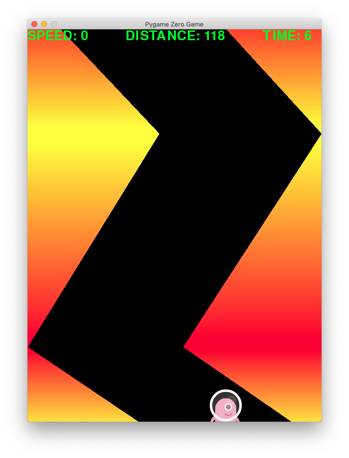

# Tutorial: Race game

In this chapter we will build a racing game together, step by step.  The Python we will use is: conditionals, loops, lists, functions and tuples.
We will show use of velocity, high score and a title screen.

## Basic game

Similar to the shooter game, we will begin with a complete program listing but with empty bodies for some of the functions
that we will fill in later.  (Python will not run a program with completely empty functions, so they just contain `pass` to indicate to
Python they do nothing.)



Like the shooter program, we begin we three things:

1. Definitions of global variables.

2. A `draw()` function.

3. An `update()` function.

These functions now check a boolean variable `playing`.  If `False` then instead of drawing/updating the game
we show the title screen.

The only really complicated part of this program is how we store the shape of the tunnel the player is racing down.
`lines` is a list of *tuples*.  A tuple is like a list but *cannot be modified* and can be *unpacked* into separate variables.
Each tuple will represent one horizontal line of the screen.  It will have three values, `x`, `x2` and `color`, representing the position of the left wall,
the gap between the left wall and the right wall and the colour of the wall.

\begin{codelisting}
\codecaption{Basic skeleton of race game}
\label{code:race7}
<<(programs/race7.py)
\end{codelisting}

\begin{aside}
\label{}
\heading{}
\noindent Run the program.  Verify it has a title screen and you can start the game and see the player.  (That is all it will do until we fill in the
remaining functions.)
\end{aside}

\newpage

## Player input

Replace the definiton of `player_input()` with this:

```python
def player_input():
    if keyboard.up:
        player.vy += 0.1
    if keyboard.down:
        player.vy -= 0.1
        if player.vy < 1:
            player.vy = 1
    if keyboard.right:
        player.vx += 0.4
    if keyboard.left:
        player.vx -= 0.4
    player.x += player.vx
```
\begin{aside}
\label{}
\heading{}
\noindent Run the program.  Verify the player can move left and right and has momentum.  Try adjusting the speed or making a limit so you can't go too fast.
\end{aside}

\newpage

## Generate the walls

We already have code to draw the walls, but currently `lines` is empty so nothing gets drawn.  Replace the function `generate_lines()` with this.  Note that we immediately call `generate_lines()` after
defining it to generate the walls for the start of the game.

```python
def generate_lines():
    global wall_gradient, left_wall_x
    gap_width = 300 + math.sin(distance / 3000) * 100
    while len(lines) < HEIGHT:
        pretty_colour = (255, 0, 0)
        lines.insert(0, (left_wall_x, gap_width, pretty_colour))
        left_wall_x += wall_gradient
        if left_wall_x < 0:
            left_wall_x = 0
            wall_gradient = random.random() * 2 + 0.1
        elif left_wall_x + gap_width > WIDTH:
            left_wall_x = WIDTH - gap_width
            wall_gradient = -random.random() * 2 - 0.1

generate_lines()
```

\begin{aside}
\label{}
\heading{Advanced}
\noindent Run the program.  Change the colour of the walls from red to green.
\end{aside}


## Make the walls colourful

Modify the line the sets the colour of the generated line to this:

```python
        pretty_colour = (255, min(left_wall_x, 255), min(time * 20, 255))
```

## Scrolling 

Modify the `scroll_walls()` function so it removes lines from the bottom of the screen according to the player's vertical
velocity.

```python
def scroll_walls():
    global distance
    for i in range(0, int(player.vy)):
        lines.pop()
        distance += 1
```
\begin{aside}
\label{}
\heading{Advanced}
\noindent Verify the player can now accelerate forward, i.e. the walls scroll.  (Can you change the amount of the acceleration?)
\end{aside}

## Wall collisions

Currently the player can move through the walls - we don't want to allow this. Also we want the player to lose all their
velocity each time they collide as a penalty.

```python
def wall_collisions():
    a, b, c = lines[-1]
    if player.x < a:
        player.x += 5
        player.vx = player.vx * -0.5
        player.vy = 0
    if player.x > a + b:
        player.x -= 5
        player.vx = player.vx * -0.5
        player.vy = 0
```

## Timer

Currently the player has infinite time.  We want decrease the `time` variable by how much time has passed and end the game
when time runs out.

```python
def timer(delta):
    global time, playing, best_distance
    time -= delta
    if time < 0:
        playing = False
        if distance > best_distance:
            best_distance = distance
```

\begin{aside}
\label{}
\heading{}
\noindent Verify the game ends after 15 seconds.  Change it so it lasts 20 seconds.
\end{aside}

## Mouse movement

The game is easier but perhaps more fun if you can play it with mouse.  Pygame will call this function for us automatically.

```python
def on_mouse_move(pos):
    x, y = pos
    player.x = x
    player.vy = (HEIGHT - y) / 20
```

## Extension ideas

* Draw a new image for the player.  Make the Actor show a different image depending on if the player is steering left or right.

* Give the player a goal distance that must be reached.  If the player reaches this distance he gets extra time added to allow him to continue.

* Add sound effects and music.